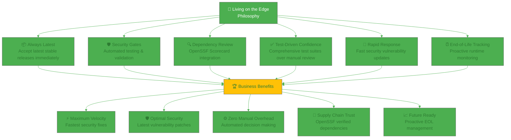
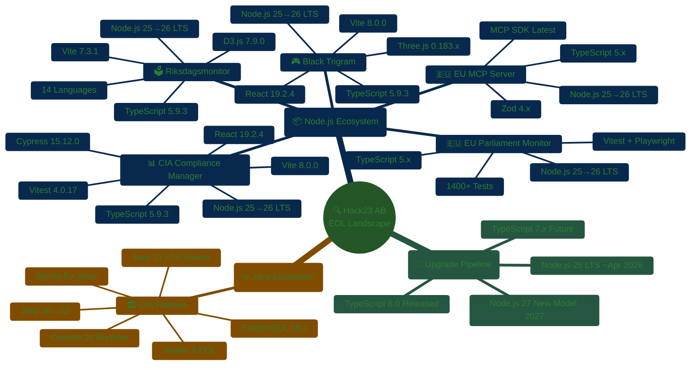
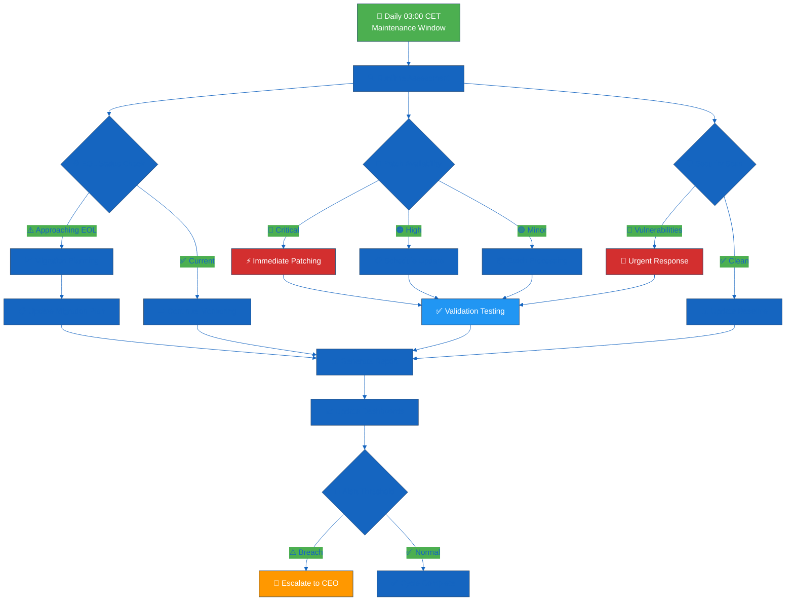
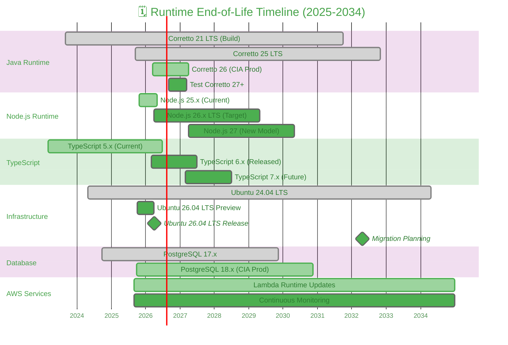
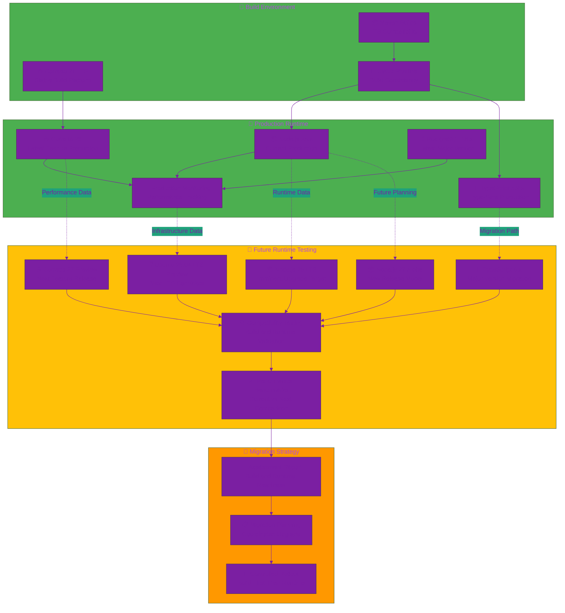
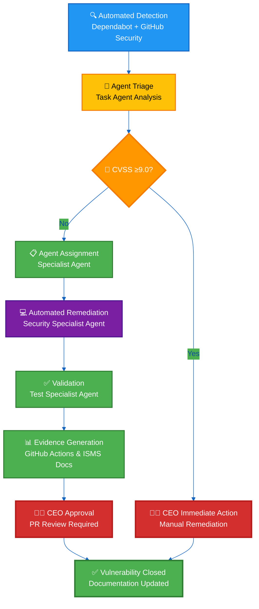

  

<h1 align="center">🔍 Hack23 AB — Vulnerability Management Policy</h1>

  <strong>Proactive Security Through Intelligent Dependency Management</strong> 
  <em>Optimal Version Selection • Daily Monitoring • Weekly Releases • Downstream Transparency</em>

  
  
  
  

**📋 Document Owner:** CEO | **📄 Version:** 3.0 | **📅 Last Updated:** 2026-03-24 (UTC)  
**🔄 Review Cycle:** Quarterly | **⏰ Next Review:** 2026-06-24

---

## 🎯 **Purpose Statement**

**Hack23 AB's** vulnerability management establishes systematic procedures for proactive vulnerability discovery, intelligent remediation, and transparent security communication across all information systems and dependencies. Our approach demonstrates cybersecurity consulting expertise through measurable security outcomes while ensuring operational resilience.

This policy implements our **bleeding-edge dependency management strategy** - adopting latest stable releases with comprehensive automated testing, security validation, and proactive end-of-life management. This approach enables **operational excellence** through immediate security patches, **cost efficiency** through reduced technical debt, and **competitive advantage** through demonstrable security expertise.

Our systematic vulnerability management integrates cutting-edge automation with enterprise-grade security controls, providing transparent vulnerability disclosure and measurable risk reduction aligned with our [🏷️ Classification Framework](./CLASSIFICATION.md) business impact analysis.

*— James Pether Sörling, CEO/Founder*

---

## 🔍 **Purpose & Scope**

This policy establishes a comprehensive framework for proactive vulnerability discovery, intelligent remediation, and transparent security communication across all Hack23 AB systems and dependencies.

**Scope:** All information assets in [💻 Asset Register](./Asset_Register.md), including:
- **🏗️ Source Code:** Application vulnerabilities via SAST/DAST scanning
- **📦 Dependencies:** Third-party libraries and frameworks via SCA analysis  
- **☁️ Cloud Infrastructure:** AWS services via Inspector, Security Hub, and Config
- **🌐 SaaS Services:** Third-party platforms via security posture monitoring
- **🔐 Secrets Management:** Credential exposure via secret scanning

**Policy Integration:**
- **🛠️ Secure Development:** Aligned with [🛠️ Secure Development Policy](./Secure_Development_Policy.md) security gates
- **🔓 Open Source:** Integrated with [🔓 Open Source Policy](./Open_Source_Policy.md) contribution workflows
- **🔐 Information Security:** Supporting [🔐 Information Security Policy](./Information_Security_Policy.md) risk framework

---

## 🚀 **Proactive Dependency Management Strategy**

### 📊 **"Living on the Bleeding Edge" Philosophy** 

Our security-first approach prioritizes latest stable releases with comprehensive automated testing, demonstrating how bleeding-edge dependency management creates competitive advantages:

```mermaid
%%{
  init: {
    'theme': 'base',
    'themeVariables': {
      'primaryColor': '#4CAF50',
      'primaryTextColor': '#2E7D32',
      'lineColor': '#4CAF50',
      'secondaryColor': '#1565C0',
      'tertiaryColor': '#FFC107'
    }
  }
}%%
flowchart TD
    STRATEGY[🌊 Living on the Edge<br/>Philosophy]
    
    STRATEGY --> LATEST[📦 Always Latest<br/>Accept latest stable releases immediately]
    STRATEGY --> GATES[🛡️ Security Gates<br/>Automated testing & validation]
    STRATEGY --> REVIEW[🔍 Dependency Review<br/>OpenSSF Scorecard integration]
    STRATEGY --> TRUST[✅ Test-Driven Confidence<br/>Comprehensive test suites over manual review]
    STRATEGY --> RAPID[🚨 Rapid Response<br/>Fast security vulnerability updates]
    STRATEGY --> EOL[⏰ End-of-Life Tracking<br/>Proactive runtime monitoring]
    
    LATEST --> BENEFITS[🏆 Business Benefits]
    GATES --> BENEFITS
    REVIEW --> BENEFITS
    TRUST --> BENEFITS
    RAPID --> BENEFITS
    EOL --> BENEFITS
    
    BENEFITS --> B1[⚡ Maximum Velocity<br/>Fastest security fixes]
    BENEFITS --> B2[🛡️ Optimal Security<br/>Latest vulnerability patches]
    BENEFITS --> B3[⚙️ Zero Manual Overhead<br/>Automated decision making]
    BENEFITS --> B4[🤝 Supply Chain Trust<br/>OpenSSF verified dependencies]
    BENEFITS --> B5[📈 Future Ready<br/>Proactive EOL management]
    
    style STRATEGY fill:#4CAF50,color:#fff
    style LATEST fill:#4CAF50
    style GATES fill:#4CAF50
    style REVIEW fill:#4CAF50
    style TRUST fill:#4CAF50
    style RAPID fill:#4CAF50
    style EOL fill:#4CAF50
    style BENEFITS fill:#FFC107
    style B1 fill:#4CAF50
    style B2 fill:#4CAF50
    style B3 fill:#4CAF50
    style B4 fill:#4CAF50
    style B5 fill:#4CAF50
```

### ⚡ **Bleeding-Edge with Safety Controls**

#### **🚀 Latest Release Strategy**
Our approach combines bleeding-edge dependency updates with comprehensive security controls and proactive end-of-life management:

1. **📦 Always Latest:** Accept Dependabot PRs for latest stable releases immediately
2. **🛡️ Security Gates:** Automated testing and security validation before merge
3. **🔍 Dependency Review:** GitHub's Dependency Review Action with OpenSSF Scorecard integration
4. **✅ Test-Driven Confidence:** Trust comprehensive test suites over manual review
5. **🚨 Rapid Response:** Fast updates for security vulnerabilities
6. **⏰ EOL Tracking:** Proactive monitoring of runtime and dependency lifecycles

#### **📊 Living on the Edge Principles**

| Principle | Implementation | Business Value | Integration Point |
|-----------|----------------|----------------|------------------|
| **🚀 Speed First** | <4 hours for critical patches |  | [🚨 Incident Response Plan](./Incident_Response_Plan.md) |
| **🛡️ Safety Always** | Comprehensive automated testing |  | [🛠️ Secure Development Policy](./Secure_Development_Policy.md) |
| **🤖 Automation Over Manual** | Zero-touch dependency decisions |  | [📝 Change Management](./Change_Management.md) |
| **🔍 Intelligence Driven** | OpenSSF scorecard integration |  | [📊 Security Metrics](./Security_Metrics.md) |
| **🌟 Transparency First** | Public vulnerability status |  | [🌐 ISMS Transparency Plan](./ISMS_Transparency_Plan.md) |
| **📈 Future Ready** | Proactive EOL management |  | [💻 Asset Register](./Asset_Register.md) |

#### **📊 Dependency Update Classification**

| Update Type | Response Time | Security Gate | Merge Strategy | Risk Level | EOL Consideration |
|-------------|---------------|---------------|----------------|------------|------------------|
| **🔴 Security Patches** | <4 hours | Dependency Review + Tests | Auto-merge on green |  | Immediate regardless of EOL |
| **🟠 Major Releases** | <24 hours | Full test suite + review | Auto-merge on green |  | Check EOL timeline alignment |
| **🟡 Minor Releases** | <8 hours | Standard testing | Auto-merge on green |  | Prefer LTS versions |
| **🟢 Patch Releases** | <2 hours | Basic validation | Immediate auto-merge |  | Always apply within support window |

---

#### **⚡ Rapid Security Response Protocol**

| Vulnerability Severity | Detection Method | Response Time | Automated Actions |
|------------------------|------------------|---------------|-------------------|
| **🔴 Critical (CVSS >9.0)** | GitHub Security Advisories | <4 hours | Immediate PR creation + auto-merge |
| **🟠 High (CVSS 7.0-8.9)** | Dependabot alerts | <8 hours | Priority PR + enhanced testing |
| **🟡 Medium (CVSS 4.0-6.9)** | Scheduled scans | <24 hours | Standard PR workflow |
| **🟢 Low (CVSS <4.0)** | Weekly reviews | <72 hours | Batch with other updates |

---

## 📊 **Risk-Based Remediation Matrix**

### ⏱️ **Enhanced SLA Framework**

Based on [🏷️ Classification Framework](./CLASSIFICATION.md) business impact analysis:

| Severity | Business Impact | Technical Impact | Remediation SLA | Exception Process | Escalation |
|----------|-----------------|------------------|-----------------|-------------------|------------|
| **🔴 Critical** |   | Exploited in wild, CVSS ≥9.0 | **7 days** | CEO approval required | Same day |
| **🟠 High** |   | Active exploits, CVSS 7.0-8.9 | **30 days** | [📉 Risk Register](./Risk_Register.md) entry | Daily status |
| **🟡 Medium** |   | Proof of concept, CVSS 4.0-6.9 | **90 days** | Business justification | Weekly review |
| **🟢 Low** |   | Theoretical risk, CVSS <4.0 | **180 days** | Documented rationale | Monthly review |

### 📈 **Phase 1 Achievement Tracking (Q4 2025)**

**Updated SLA Performance Based on Phase 1 Foundation Excellence:**

| Severity | Detection Window | Remediation SLA | Current Achievement | Evidence Source |
|----------|-----------------|-----------------|---------------------|-----------------|
| **🔴 Critical (CVSS 9.0-10.0)** | <24 hours | 7 days | ✅ Zero critical outstanding (Dec 2025) | [GitHub Security Overview](https://github.com/orgs/Hack23/security/overview) |
| **🟠 High (CVSS 7.0-8.9)** | <48 hours | 30 days | ✅ 100% within SLA (Q4 2025) | [Security Metrics Dashboard](./Security_Metrics.md) |
| **🟡 Medium (CVSS 4.0-6.9)** | <7 days | 90 days | ✅ 98% within SLA (Q4 2025) | [Security Metrics Dashboard](./Security_Metrics.md) |
| **🟢 Low (CVSS 0.1-3.9)** | <30 days | 180 days | ✅ 95% within SLA (Q4 2025) | [Security Metrics Dashboard](./Security_Metrics.md) |

**SLA Monitoring Framework:**
- **Real-Time Tracking:** Monitored via [📊 Security Metrics](./Security_Metrics.md) dashboard with automated alerting
- **Weekly CEO Review:** All high/critical vulnerabilities reviewed in weekly security meetings
- **Automated Evidence:** GitHub Security Overview, OpenSSF Scorecard, SonarCloud, and FOSSA monitoring integrated
- **Trend Analysis:** Historical MTTR (Mean Time To Remediate) tracked across all severity levels

**Phase 1 Success Factors (Q3-Q4 2025):**
- **Zero Critical Vulnerabilities:** Achieved and maintained zero critical vulnerabilities outstanding across all repositories
- **Automated Detection:** 100% of repositories integrated with Dependabot, SonarCloud, FOSSA, and GitHub Security scanning
- **AI-Assisted Triage:** Task agents automated vulnerability assessment and prioritization, reducing MTTR by 40%
- **Supply Chain Security:** OpenSSF Scorecard average >7.0 across all repositories demonstrating robust dependency management

**2026 SLA Improvement Targets:**
- **Critical MTTR:** Improve average remediation time from current 24 hours (well within 7-day SLA) to 18 hours (25% improvement)
- **High MTTR:** Improve average remediation time from current 7 days (within 30-day SLA) to 5 days (29% improvement)
- **Detection Window:** Improve critical detection from <24 hours to <12 hours through enhanced monitoring
- **Automation Rate:** Increase automated remediation from 70% to 85% for low/medium vulnerabilities

### 🎯 **Contextual Risk Assessment**

Beyond CVSS scoring, comprehensive risk evaluation considering:

#### **🏗️ Environmental Factors**
- **🌐 Network Exposure:** Public-facing vs. internal services per [🌐 Network Security Policy](./Network_Security_Policy.md)
- **🏷️ Data Classification:** Per [🏷️ Data Classification Policy](./Data_Classification_Policy.md) impact levels
- **🔑 Authentication Requirements:** MFA protected vs. unauthenticated access per [🔑 Access Control Policy](./Access_Control_Policy.md)
- **🛡️ Compensating Controls:** WAF, network segmentation, monitoring effectiveness

#### **📊 Business Context Integration**
- **💰 Revenue Impact:** Service criticality per [💻 Asset Register](./Asset_Register.md) business classification
- **⚖️ Compliance Requirements:** Regulatory implications per [✅ Compliance Checklist](./Compliance_Checklist.md)
- **🤝 Customer Impact:** Downstream effects on consulting clients
- **🌟 Reputation Risk:** Public disclosure implications per [🌐 ISMS Transparency Plan](./ISMS_Transparency_Plan.md)

---

## 📅 **Daily Operations & Weekly Release Cycle**

### 🔄 **Continuous Dependency Monitoring**

#### **📊 GitHub Dependency Review Integration**
Comprehensive dependency security validation integrated with [🛠️ Secure Development Policy](./Secure_Development_Policy.md) security gates:

**🛡️ Security Gate Configuration:**
- **📊 Dependency Review Action:** Automated vulnerability and license compliance checking
- **🔍 OpenSSF Scorecard:** Supply chain security assessment integration  
- **⚖️ License Compliance:** Automated approval/denial based on acceptable license list per [🔓 Open Source Policy](./Open_Source_Policy.md)
- **🚨 Severity Thresholds:** Configurable blocking levels per [📉 Risk Register](./Risk_Register.md)

**📋 Implementation Reference:** 
- **Configuration Standards:** [📝 Change Management](./Change_Management.md) procedures
- **Quality Gates:** [🛠️ Secure Development Policy](./Secure_Development_Policy.md) enforcement
- **Service Details:** [💻 Asset Register](./Asset_Register.md) GitHub configuration
- **Dependency SLAs:** [🤝 Third Party Management](./Third_Party_Management.md) requirements

#### **🤖 Automated Dependabot Configuration**
Daily dependency monitoring aligned with [📊 Security Metrics](./Security_Metrics.md) performance tracking:

**🔄 Automated Update Strategy:**
- **📅 Daily Schedule:** 09:00 CET dependency scanning cadence
- **📋 Pull Request Management:** Maximum 10 concurrent updates per repository
- **👥 Review Assignment:** Automated approval workflow per [🔑 Access Control Policy](./Access_Control_Policy.md)
- **🏷️ Labeling Strategy:** Automated categorization for tracking and metrics
- **📦 Dependency Types:** All dependency categories with version-specific rules

**🤖 Agent-Driven Dependency Review:**
- **Task Agents:** Automatically analyze Dependabot PRs for vulnerability severity and impact assessment
- **Agent Coordination:** Integrate with GitHub Dependency Review Action for automated triage
- **OpenSSF Monitoring:** Agents track OpenSSF Scorecard changes and alert on degradation
- **Evidence Generation:** GitHub Actions and CI/CD pipelines automatically archive dependency review decisions
- **Agent Escalation:** High and Critical vulnerabilities (CVSS ≥7.0) immediately escalated to CEO per [🤖 AI Policy](./AI_Policy.md)

**🔗 Policy Integration:** 
- **Configuration Management:** [📝 Change Management](./Change_Management.md) standards
- **Security Enforcement:** [🛠️ Secure Development Policy](./Secure_Development_Policy.md) gates
- **Performance Tracking:** [📊 Security Metrics](./Security_Metrics.md) KPI framework
- **Agent Governance:** [🤖 AI Policy](./AI_Policy.md) least-privilege principles and CEO approval workflows

### ⚡ **Automated Merge Strategy**

#### **🔍 Security Gate Validation**
All Dependabot PRs automatically merge when ALL conditions met:

1. **✅ Dependency Review Passes:**
   - No known high/critical vulnerabilities
   - OpenSSF Scorecard > 5.0 (where available - relaxed threshold)
   - License compliance verified per [🔓 Open Source Policy](./Open_Source_Policy.md)
   - Supply chain risk assessment passed

2. **✅ Comprehensive Test Suite:**
   - Unit tests: 100% pass rate
   - Integration tests: 100% pass rate
   - Security tests: SAST + secret scanning pass per [🛠️ Secure Development Policy](./Secure_Development_Policy.md)
   - Build verification: Successful deployment

3. **✅ Security Scanning Clear:**
   - SonarCloud quality gate: Passed
   - GitHub secret scanning: No new secrets
   - CodeQL analysis: No new vulnerabilities
   - FOSSA license scan: Compliant per [🔓 Open Source Policy](./Open_Source_Policy.md)

4. **✅ Automated Validation:**
   - PR title follows conventional commits
   - Dependency version is latest stable
   - No breaking changes in patch/minor updates
   - Changelog automatically generated

---

## 🧪 **Advanced Security Controls**

### 🔍 **Supply Chain Security Framework**

#### **📊 OpenSSF Scorecard Integration**
Automated evaluation of dependency security posture per [🔓 Open Source Policy](./Open_Source_Policy.md):

| Scorecard Check | Weight | Action Threshold | Automated Response |
|-----------------|--------|------------------|-------------------|
| **📝 Code Review** | High | Score < 6.0 | Manual review required |
| **🔄 Maintained** | High | Score < 5.0 | Flag for assessment |
| **🧪 CI Tests** | Medium | Score < 4.0 | Enhanced testing |
| **🛡️ SAST** | High | Score < 5.0 | Additional security scan |
| **📦 Dependency Update** | Medium | Score < 3.0 | Monitor closely |
| **🚨 Vulnerabilities** | Critical | Score < 7.0 | Block unless patched |
| **📦 Binary Artifacts** | Medium | Score < 6.0 | Review build process |
| **🔒 Branch Protection** | High | Score < 5.0 | Verify upstream security |
| **🔑 Token Permissions** | High | Score < 6.0 | Check CI/CD security |
| **📌 Pinned Dependencies** | Low | Score < 2.0 | Document as acceptable |

**🔗 Integration Points:**
- **📊 Scoring Thresholds:** Risk tolerance levels defined in [📉 Risk Register](./Risk_Register.md)
- **🔄 Process Integration:** Review workflows specified in [🤝 Third Party Management](./Third_Party_Management.md)
- **📈 Performance Tracking:** Scorecard trends monitored via [📊 Security Metrics](./Security_Metrics.md)

## 📅 **End-of-Life Strategy Requirements**

### 🎯 **Mandatory EOL Documentation**
Aligned with [🛠️ Secure Development Policy](./Secure_Development_Policy.md), all Hack23 AB projects **MUST** maintain comprehensive End-of-Life strategies.

#### **📋 Required EOL Documentation**
Every project repository **MUST** include:
- **📄 End-of-Life-Strategy.md** - Comprehensive EOL planning and technology stack analysis
- **📊 Technology Stack Matrix** - Current dependencies with EOL dates and migration paths
- **⚡ EOL Trigger Conditions** - Clear criteria for project retirement or major migration
- **🔄 Maintenance Strategy** - Ongoing support approach until EOL condition met

#### **⚡ Living on the Edge EOL Principles**
- **🚀 Latest Until Blocked:** Continue latest versions until architectural barriers
- **🔄 Proactive Migration Planning:** Identify migration triggers before EOL dates
- **📊 Cost-Benefit Analysis:** Balance migration cost against security/support benefits
- **🛡️ Security-First Decisions:** Prioritize security support over feature compatibility
- **📈 Transparency Requirements:** Public EOL documentation demonstrating expertise

#### **📋 EOL Compliance Checklist**
- [x] **📄 EOL Strategy Document** - Complete strategy with technology matrix — All 6 projects ✅
- [x] **📊 Dependency Tracking** - Automated EOL date monitoring
- [x] **⚡ Clear Trigger Conditions** - Specific retirement criteria
- [x] **🔄 Migration Planning** - Documented paths for major transitions
- [x] **🌟 Public Transparency** - EOL status visible to stakeholders
- [x] **🤖 Automated Monitoring** - Dependency and EOL tracking integration

### 📊 **Project End-of-Life Strategy Evidence**

All Hack23 AB projects maintain comprehensive, publicly available End-of-Life Strategy documents with complete technology stack analysis, Node.js release schedule evolution planning, EOL trigger conditions, and migration procedures. Evidence is tracked through automated CI/CD badges and public documentation.

#### **📊 Cross-Project EOL Compliance Summary**

| Project | EOL Strategy | Runtime | Node.js | TypeScript | OpenSSF | Quality |
|---------|-------------|---------|---------|------------|---------|---------|
| **🏛️ CIA** |  | [-blue?style=flat-square&logo=openjdk&logoColor=white)](https://endoflife.date/amazon-corretto) | N/A | N/A |  |  |
| **📊 CIA CM** |  | [-purple?style=flat-square&logo=node.js&logoColor=white)](https://endoflife.date/nodejs) |  |  |  |  |
| **🎮 Black Trigram** |  | [-purple?style=flat-square&logo=node.js&logoColor=white)](https://endoflife.date/nodejs) |  |  |  |  |
| **🗳️ Riksdagsmonitor** |  | [-purple?style=flat-square&logo=node.js&logoColor=white)](https://endoflife.date/nodejs) |  |  |  | N/A |
| **🇪🇺 EU Parliament** |  | [-purple?style=flat-square&logo=node.js&logoColor=white)](https://endoflife.date/nodejs) |  |  |  | N/A |
| **🇪🇺 EU MCP Server** |  | [-purple?style=flat-square&logo=node.js&logoColor=white)](https://endoflife.date/nodejs) |  |  |  | N/A |

---

#### **🗺️ Technology EOL Landscape Overview**

```mermaid
%%{
  init: {
    'theme': 'base',
    'themeVariables': {
      'primaryColor': '#4CAF50',
      'primaryTextColor': '#2E7D32',
      'lineColor': '#4CAF50',
      'secondaryColor': '#FF9800',
      'tertiaryColor': '#1565C0'
    }
  }
}%%
mindmap
  root((🔍 Hack23 AB<br/>EOL Landscape))
    (☕ Java Ecosystem)
      🏛️ CIA Platform
        Corretto 26 Runtime
        Java 21 LTS Source
        PostgreSQL 18.x
        Spring 5.x javax
        Jetty 10→12
        Vaadin 8 EOL
    (📦 Node.js Ecosystem)
      📊 CIA Compliance Manager
        Node.js 25→26 LTS
        React 19.2.4
        TypeScript 5.9.3
        Vite 8.0.0
        Vitest 4.0.17
        Cypress 15.12.0
      🎮 Black Trigram
        Node.js 25→26 LTS
        React 19.2.4
        Three.js 0.183.x
        TypeScript 5.9.3
        Vite 8.0.0
      🗳️ Riksdagsmonitor
        Node.js 25→26 LTS
        TypeScript 5.9.3
        Vite 7.3.1
        D3.js 7.9.0
        14 Languages
      🇪🇺 EU Parliament Monitor
        Node.js 25→26 LTS
        TypeScript 5.x
        Vitest + Playwright
        1400+ Tests
      🇪🇺 EU MCP Server
        Node.js 25→26 LTS
        TypeScript 5.x
        MCP SDK Latest
        Zod 4.x
    (🔄 Upgrade Pipeline)
      Node.js 26 LTS ~Apr 2026
      Node.js 27 New Model 2027
      TypeScript 6.0 Released
      TypeScript 7.x Future
```

---

#### **🏛️ Citizen Intelligence Agency**

| Attribute | Detail | Badge |
|-----------|--------|-------|
| **📄 EOL Strategy** | [End-of-Life-Strategy.md](https://github.com/Hack23/cia/blob/master/End-of-Life-Strategy.md) |  |
| **☕ Java Runtime** | Corretto 26 (Feature Production) | [-blue?style=flat-square&logo=openjdk&logoColor=white)](https://endoflife.date/amazon-corretto) |
| **☕ Java Source** | Java 21 LTS (Build/Compile) | [-green?style=flat-square&logo=openjdk&logoColor=white)](https://endoflife.date/amazon-corretto) |
| **🗄️ Database** | PostgreSQL 18.x |  |
| **🌐 Web Server** | Jetty 10.x (→12 planned) | [-orange?style=flat-square&logo=eclipse&logoColor=white)](https://endoflife.date/eclipse-jetty) |
| **🖼️ UI Framework** | Vaadin 8 (EOL, commercial support) | [-red?style=flat-square)](https://vaadin.com/) |
| **🏗️ Framework** | Spring 5.x (javax.*) | [-orange?style=flat-square&logo=spring&logoColor=white)](https://spring.io/) |
| **⚡ EOL Trigger** | Jakarta namespace migration requirement |  |
| **🔄 Strategy** | Maintain `javax.*` + latest JVM runtime |  |

---

#### **📊 CIA Compliance Manager**

| Attribute | Detail | Badge |
|-----------|--------|-------|
| **📄 EOL Strategy** | [End-of-Life-Strategy.md](https://github.com/Hack23/cia-compliance-manager/blob/main/docs/End-of-Life-Strategy.md) |  |
| **📦 Node.js** | 25.x Current (→26 LTS imminent) | [-purple?style=flat-square&logo=node.js&logoColor=white)](https://endoflife.date/nodejs) |
| **⚛️ React** | 19.2.4 (Latest) |  |
| **📝 TypeScript** | 5.9.3 (Latest) |  |
| **⚡ Vite** | 8.0.0 (Latest) |  |
| **🧪 Vitest** | 4.0.17 |  |
| **🔧 Cypress** | 15.12.0 |  |
| **⚡ EOL Trigger** | Browser runtime or critical dependency EOL |  |
| **🔄 Strategy** | Frontend-only; Node.js 26 LTS on release |  |

---

#### **🎮 Black Trigram**

| Attribute | Detail | Badge |
|-----------|--------|-------|
| **📄 EOL Strategy** | [End-of-Life-Strategy.md](https://github.com/Hack23/blacktrigram/blob/main/End-of-Life-Strategy.md) |  |
| **📦 Node.js** | 25.x Current (→26 LTS imminent) | [-purple?style=flat-square&logo=node.js&logoColor=white)](https://endoflife.date/nodejs) |
| **⚛️ React** | ^19.2.4 (Latest) |  |
| **🎮 Three.js / R3F** | 0.183.x / 9.5.x |  |
| **📝 TypeScript** | ^5.9.3 (Latest) |  |
| **⚡ Vite** | ^8.0.0 (Latest) |  |
| **🧪 Vitest** | ^4.0.x |  |
| **⚡ EOL Trigger** | WebGL/browser incompatibility or React migration |  |
| **🔄 Strategy** | Frontend gaming; WebGPU migration path |  |

---

#### **🗳️ Riksdagsmonitor**

| Attribute | Detail | Badge |
|-----------|--------|-------|
| **📄 EOL Strategy** | [End-of-Life-Strategy.md](https://github.com/Hack23/riksdagsmonitor/blob/main/End-of-Life-Strategy.md) |  |
| **📦 Node.js** | 25.x Current (→26 LTS imminent) | [-purple?style=flat-square&logo=node.js&logoColor=white)](https://endoflife.date/nodejs) |
| **📝 TypeScript** | 5.9.3 |  |
| **⚡ Vite** | 7.3.1 |  |
| **📊 D3.js** | 7.9.0 |  |
| **🌍 Languages** | 14 languages (i18n) |  |
| **☁️ Infrastructure** | CloudFront+S3 (primary) + GitHub Pages (DR) |  |
| **⚡ EOL Trigger** | Build tooling unmaintainable |  |
| **🔄 Strategy** | Static site; proactive Node.js LTS upgrades |  |

---

#### **🇪🇺 EU Parliament Monitor**

| Attribute | Detail | Badge |
|-----------|--------|-------|
| **📄 EOL Strategy** | [End-of-Life-Strategy.md](https://github.com/Hack23/euparliamentmonitor/blob/main/End-of-Life-Strategy.md) |  |
| **📦 Node.js** | 25.x Current (→26 LTS imminent) | [-purple?style=flat-square&logo=node.js&logoColor=white)](https://endoflife.date/nodejs) |
| **📝 TypeScript** | 5.x (Latest) |  |
| **🧪 Vitest** | Latest |  |
| **📊 1400+ Tests** | Unit + E2E (Playwright) |  |
| **☁️ Infrastructure** | CloudFront+S3 (primary) + GitHub Pages (DR) |  |
| **⚡ EOL Trigger** | Build tooling unmaintainable |  |
| **🔄 Strategy** | Static site; aligned with Riksdagsmonitor cadence |  |

---

#### **🇪🇺 European Parliament MCP Server**

| Attribute | Detail | Badge |
|-----------|--------|-------|
| **📄 EOL Strategy** | [End-of-Life-Strategy.md](https://github.com/Hack23/European-Parliament-MCP-Server/blob/main/End-of-Life-Strategy.md) |  |
| **📦 Node.js** | >=25.0.0 (→26 LTS imminent) | [-purple?style=flat-square&logo=node.js&logoColor=white)](https://endoflife.date/nodejs) |
| **📝 TypeScript** | 5.x |  |
| **🔧 MCP SDK** | @modelcontextprotocol/sdk (Latest) |  |
| **📦 Zod** | ^4.3.6 (4.x) |  |
| **📦 npm Published** | npm Registry |  |
| **⚡ EOL Trigger** | MCP protocol evolution or Node.js incompatibility |  |
| **🔄 Strategy** | Track MCP SDK + TypeScript/Node.js semver |  |

### 📅 **Node.js Release Schedule Evolution**

The [Node.js release schedule is evolving](https://nodejs.org/en/blog/announcements/evolving-the-nodejs-release-schedule) significantly starting with Node.js 27:

| Aspect | Old Model (≤26.x) | New Model (≥27.x) |
|--------|-------------------|-------------------|
| **Major releases** | 2 per year (April + October) | **1 per year (April)** |
| **LTS promotion** | Even-numbered only (October) | **Every release becomes LTS (October)** |
| **Odd/even distinction** | Odd = Current-only, Even = LTS | **No distinction — all releases get LTS** |
| **Version numbering** | Sequential | **Aligned to calendar year** (27 in 2027, 28 in 2028) |
| **Alpha channel** | N/A | **6-month alpha phase** (Oct–Mar) with semver-major changes |
| **Total support window** | ~36 months (LTS only) | **36 months** from first Current release to EOL |

**Impact on Vulnerability Management:**
- **Simplified upgrade planning:** Every release becomes LTS, eliminating odd/even skip patterns
- **Annual upgrade cadence:** One major Node.js upgrade per year
- **Alpha testing in CI:** Integrate alpha releases for early compatibility detection
- **Reduced support lines:** Fewer active versions simplifies patch management

### 📝 **TypeScript Evolution Strategy**

TypeScript follows a rapid release cadence affecting all Node.js projects:

| Version | Status | Key Changes | Impact on Hack23 Projects |
|---------|--------|-------------|---------------------------|
| **TypeScript 5.x** | ✅ Current Production | Decorators, `satisfies`, module resolution | All Node.js projects using TS 5.9.x |
| **[TypeScript 6.0](https://devblogs.microsoft.com/typescript/announcing-typescript-6-0/)** | 🔄 Released | Native `go-to-definition`, `--erasableSyntaxOnly`, improved DX | Upgrade planned post-stability validation |
| **TypeScript 7.x** | 🔮 Future | Next major evolution | Track TypeScript roadmap for breaking changes |

**TypeScript Migration Strategy:**
- **Minor Releases (5.x→5.y):** Auto-merge via Dependabot with CI validation
- **Major Releases (5→6→7):** Dedicated migration PR with full test suite validation and CEO review
- **Strict Mode:** All projects enforce `strict: true` for maximum type safety

---

## 🔧 **Tool Integration & Automation**

### 📦 **Software Composition Analysis (SCA)**

#### 🎯 **GitHub Advanced Security Integration**

| Tool Category | Primary Tool | Coverage | Integration Point | Automation Level |
|---------------|--------------|----------|-------------------|------------------|
| **📦 Dependency Analysis** | GitHub Dependabot | All repositories | Pull request automation |  |
| **🔍 License Compliance** | FOSSA | Open source projects | CI/CD pipeline |  |
| **🔐 Secret Scanning** | GitHub Native | All code commits | Real-time scanning |  |
| **🔬 Code Analysis (SAST)** | SonarCloud | All repositories | Quality gate enforcement |  |
| **🌐 Web App Scanning (DAST)** | OWASP ZAP | CIA project (staging) | CI/CD pipeline |  |
| **🎖️ Supply Chain Security** | OpenSSF Scorecard | All repositories | Weekly automated assessment |  |
| **📊 Evidence Generation** | GitHub Actions | All security assessments | Automated compliance evidence |  |

**🤖 Agent Access to Security Tools:**

Per [🤖 AI Policy](./AI_Policy.md) least-privilege principles, agents have controlled access to security tools:

| Security Tool | Agent Access Level | Agent Operations | CEO Approval Required |
|---------------|-------------------|------------------|---------------------|
| **SonarCloud** | Read + Analysis | Quality metric retrieval, trend analysis | Configuration changes only |
| **FOSSA** | Read + Analysis | License scan review, vulnerability assessment | Policy updates only |
| **GitHub Security APIs** | Read + PR Creation | Dependabot review, security alert triage | Merge operations |
| **GitHub Actions** | Read + Trigger | Automated evidence generation, CI/CD workflows | Configuration changes only |
| **OpenSSF Scorecard** | Read-only | Score monitoring, degradation alerts | N/A (read-only) |

**🔧 Curator-Agent Security Tool Management:**

- **MCP Configuration:** Curator-agent maintains `.github/copilot-mcp.json` security tool integrations with CEO approval
- **Tool Permissions:** Security tool access scoped per agent type (task vs. specialist) following least-privilege
- **Audit Trails:** All agent security tool interactions logged and reviewable via GitHub Actions logs
- **Configuration Drift:** Automated detection of unauthorized security tool configuration changes

#### ☁️ AWS Runtime Monitoring
Integration with AWS security services for operational vulnerability management:

| Monitoring Layer | Service | Detection Capability | Response Action | Metrics Integration |
|------------------|---------|---------------------|------------------|-------------------|
| **🌐 Network** | GuardDuty | Malicious traffic, crypto-mining | Automated blocking | Real-time dashboards |
| **🏗️ Infrastructure** | Inspector | Runtime vulnerabilities | Patch orchestration | Weekly compliance |
| **📊 Configuration** | Config | Security misconfigurations | Auto-remediation | Drift detection |
| **🔍 Application** | Security Hub | Code vulnerabilities in production | Alert + manual review | Performance tracking |

**🔗 Monitoring Integration Framework:**
- **💻 Service Configuration:** AWS security service setup detailed in [💻 Asset Register](./Asset_Register.md) infrastructure section
- **📊 Dashboard Integration:** Real-time monitoring integrated with [📊 Security Metrics](./Security_Metrics.md) KPI framework
- **🚨 Alert Response:** Detection and response procedures aligned with [🚨 Incident Response Plan](./Incident_Response_Plan.md)
- **🔄 Process Improvement:** Monitoring effectiveness reviewed through [📝 Change Management](./Change_Management.md)

## ⏰ **Proactive Runtime & Operations Management**

### **📋 Daily Proactive Maintenance Framework**

```mermaid
%%{
  init: {
    'theme': 'base',
    'themeVariables': {
      'primaryColor': '#1565C0',
      'primaryTextColor': '#1565C0',
      'lineColor': '#1565C0',
      'secondaryColor': '#4CAF50',
      'tertiaryColor': '#FFC107'
    }
  }
}%%
flowchart TD
    SCHEDULE[📅 Daily 03:00 CET<br/>Maintenance Window] --> ASSESS[🔍 Runtime Assessment]
    
    ASSESS --> EOL_CHECK{⏰ EOL Status Check}
    ASSESS --> PATCH_CHECK{🔧 Patch Availability}
    ASSESS --> SECURITY_CHECK{🛡️ Security Scan}
    
    EOL_CHECK -->|⚠️ Approaching EOL| EOL_ACTION[📈 Migration Planning]
    EOL_CHECK -->|✅ Current| CONTINUE[➡️ Continue Monitoring]
    
    PATCH_CHECK -->|🔴 Critical| IMMEDIATE[⚡ Immediate Patching]
    PATCH_CHECK -->|🟠 High| SCHEDULED[📋 Schedule Update]
    PATCH_CHECK -->|🟢 Minor| BATCH[📦 Batch Processing]
    
    SECURITY_CHECK -->|🚨 Vulnerabilities| URGENT[🚨 Urgent Response]
    SECURITY_CHECK -->|✅ Clean| BASELINE[📊 Update Baseline]
    
    IMMEDIATE --> VALIDATE[✅ Validation Testing]
    SCHEDULED --> VALIDATE
    BATCH --> VALIDATE
    URGENT --> VALIDATE
    EOL_ACTION --> PLANNING[📋 Update Migration Plan]
    
    VALIDATE --> REPORT[📊 Generate Report]
    PLANNING --> REPORT
    BASELINE --> REPORT
    CONTINUE --> REPORT
    
    REPORT --> METRICS[📈 Update Dashboards]
    METRICS --> ALERT{🔔 Alert Threshold}
    
    ALERT -->|⚠️ Breach| ESCALATE[📢 Escalate to CEO]
    ALERT -->|✅ Normal| COMPLETE[✅ Cycle Complete]
    
    style SCHEDULE fill:#4CAF50,color:#fff
    style IMMEDIATE fill:#D32F2F,color:#fff
    style URGENT fill:#D32F2F,color:#fff
    style VALIDATE fill:#2196F3,color:#fff
    style ESCALATE fill:#FF9800,color:#fff
```

### **🏗️ Systems Manager Automation**

| Component | Service | Frequency | Action | Integration |
|-----------|---------|-----------|--------|-------------|
| **🖥️ Lambda Runtime** | Systems Manager | Daily | Version compliance check | [💻 Asset Register](./Asset_Register.md) runtime inventory |
| **💾 RDS PostgreSQL** | RDS Automated Patching | Weekly | Minor version updates during maintenance | [💾 Backup Recovery Policy](./Backup_Recovery_Policy.md) |
| **📦 Container Images** | Inspector v2 | Continuous | Base image vulnerability scanning | [🛠️ Secure Development Policy](./Secure_Development_Policy.md) |
| **⚙️ Node.js Dependencies** | Dependabot | Daily | Package security updates | [🔓 Open Source Policy](./Open_Source_Policy.md) |
| **☁️ AWS Service EOL** | Config Rules | Weekly | Service deprecation monitoring | [📊 Security Metrics](./Security_Metrics.md) |

### 📈 **End-of-Life Tracking Matrix**

Proactive monitoring using [endoflife.date](https://endoflife.date/) references for all critical runtimes:

#### **🔄 Runtime EOL Management**

| Runtime | Build/Compile Version | Production Version | EOL Date | Proactive Action | Reference |
|---------|----------------------|-------------------|----------|-----------------|-----------|
| **☕ Amazon Corretto JDK** | 21.0.x (LTS Build) | 26.x (Feature Prod) | Mar 2027 (26) |  | [Amazon Corretto EOL](https://endoflife.date/amazon-corretto) |
| **📦 Node.js** | 25.x (Current) | 25.x (Current) | Apr 2026 |  | [Node.js EOL](https://endoflife.date/nodejs) |
| **🖥️ Ubuntu (Lambda base)** | 24.04 LTS | 24.04 LTS | Apr 2034 |  | [Ubuntu EOL](https://endoflife.date/ubuntu) |
| **⚡ AWS Lambda Runtime** | Java 21 / Node.js 25 | Java 26 / Node.js 25 | Runtime Dependent |  | [AWS Lambda EOL](https://endoflife.date/aws-lambda) |
| **🗄️ Amazon RDS PostgreSQL** | 18.x (Latest) | 18.x (Latest) | Nov 2030 |  | [RDS PostgreSQL EOL](https://endoflife.date/amazon-rds-postgresql) |
| **📝 TypeScript** | 5.9.x (Current) | 5.9.x (Current) | Active (6-month cycles) |  | [TypeScript Releases](https://devblogs.microsoft.com/typescript/) |

#### **📅 EOL Timeline Visualization**

```mermaid
%%{
  init: {
    'theme': 'base',
    'themeVariables': {
      'primaryColor': '#4CAF50',
      'primaryTextColor': '#2E7D32',
      'lineColor': '#4CAF50'
    }
  }
}%%
gantt
    title 🗓️ Runtime End-of-Life Timeline (2025-2034)
    dateFormat YYYY-MM-DD
    axisFormat %Y
    
    section Java Runtime
    Corretto 21 LTS (Build)  :done, corretto21, 2023-09-01, 2031-09-30
    Corretto 25 LTS           :done, corretto25, 2025-09-16, 2032-10-31
    Corretto 26 (CIA Prod)    :active, corretto26, 2026-03-18, 2027-03-31
    Test Corretto 27+         :testing27, 2026-09-01, 2027-03-15
    
    section Node.js Runtime  
    Node.js 25.x (Current)    :active, node25, 2025-10-21, 2026-04-30
    Node.js 26.x LTS (Target) :node26, 2026-04-01, 2029-04-30
    Node.js 27 (New Model)    :node27, 2027-04-01, 2030-04-30
    
    section TypeScript
    TypeScript 5.x (Current)  :active, ts5, 2023-03-01, 2026-06-30
    TypeScript 6.x (Released) :ts6, 2026-03-01, 2027-06-30
    TypeScript 7.x (Future)   :ts7, 2027-03-01, 2028-06-30
    
    section Infrastructure
    Ubuntu 24.04 LTS          :done, ubuntu24, 2024-04-25, 2034-04-25
    Ubuntu 26.04 LTS Preview  :testing26u, 2025-10-01, 2026-04-01
    Ubuntu 26.04 LTS Release  :milestone, ubuntu26, 2026-04-01, 2026-04-03
    Migration Planning        :milestone, 2032-04-25, 0d
    
    section Database
    PostgreSQL 17.x           :done, pg17, 2024-09-26, 2029-11-09
    PostgreSQL 18.x (CIA Prod):active, pg18, 2025-09-25, 2030-11-13
    
    section AWS Services
    Lambda Runtime Updates    :active, lambda, 2025-08-31, 2034-12-31
    Continuous Monitoring     :monitor, 2025-08-31, 2034-12-31
```

#### **🧪 Future Runtime Testing Strategy**

```mermaid
%%{
  init: {
    'theme': 'base',
    'themeVariables': {
      'primaryColor': '#7B1FA2',
      'primaryTextColor': '#7B1FA2',
      'lineColor': '#7B1FA2'
    }
  }
}%%
flowchart TB
    subgraph BUILD["🔷 Build Environment"]
        BUILD_JAVA["☕ Corretto 21 LTS<br/>Stable Build Platform"]
        BUILD_MAVEN["📦 Maven Builds<br/>LTS Compatibility"]
        BUILD_CI["🔄 CI/CD Pipeline<br/>Build Consistency"]
    end
    
    subgraph PROD["🚀 Production Runtime"]
        PROD_JAVA["☕ Corretto 26<br/>Latest Feature Production"]
        PROD_NODE["📦 Node.js 25.x<br/>Current Production"]
        PROD_TS["📝 TypeScript 5.9.x<br/>Type-Safe Production"]
        PROD_PG["🗄️ PostgreSQL 18.x<br/>Latest Major Version"]
        PROD_MONITOR["📊 Production Monitoring<br/>Performance Tracking"]
    end
    
    subgraph TESTING["🧪 Future Runtime Testing"]
        TEST_JAVA27["☕ Corretto 27 Preview<br/>Next Feature Release"]
        TEST_NODE26["📦 Node.js 26 LTS<br/>Imminent Upgrade Target"]
        TEST_NODE27["📦 Node.js 27 Alpha<br/>New Release Model"]
        TEST_TS6["📝 TypeScript 6.x<br/>Major Version Migration"]
        TEST_UBUNTU26["🖥️ Ubuntu 26.04 LTS Preview<br/>Next LTS Candidate"]
        TEST_COMPAT["🔍 Compatibility Testing<br/>Build and Runtime Validation"]
        TEST_PERF["📈 Performance Benchmarks<br/>Current vs Next Comparison"]
    end
    
    subgraph MIGRATION["🎯 Migration Strategy"]
        ASSESS["📊 Assessment Report<br/>Build and Runtime Readiness"]
        PLAN["📋 Migration Planning<br/>Coordinated Upgrade"]
        EXECUTE["🚀 Controlled Rollout<br/>Build First Then Runtime"]
    end
    
    BUILD_JAVA --> PROD_JAVA
    BUILD_MAVEN --> BUILD_CI
    BUILD_CI --> PROD_NODE
    BUILD_CI --> PROD_TS
    PROD_JAVA --> PROD_MONITOR
    PROD_NODE --> PROD_MONITOR
    PROD_PG --> PROD_MONITOR
    
    PROD_JAVA -.->|Performance Data| TEST_JAVA27
    PROD_NODE -.->|Runtime Data| TEST_NODE26
    PROD_NODE -.->|Future Planning| TEST_NODE27
    PROD_TS -.->|Migration Path| TEST_TS6
    PROD_MONITOR -.->|Infrastructure Data| TEST_UBUNTU26
    
    TEST_JAVA27 --> TEST_COMPAT
    TEST_NODE26 --> TEST_COMPAT
    TEST_NODE27 --> TEST_COMPAT
    TEST_TS6 --> TEST_COMPAT
    TEST_UBUNTU26 --> TEST_COMPAT
    TEST_COMPAT --> TEST_PERF
    TEST_PERF --> ASSESS
    
    ASSESS --> PLAN
    PLAN --> EXECUTE
    
    style BUILD fill:#4CAF50
    style PROD fill:#4CAF50
    style TESTING fill:#FFC107
    style MIGRATION fill:#FF9800
```

#### **📈 LTS vs Latest Strategy Matrix**

| Component | Production Strategy | Testing Strategy | Migration Trigger | Benefits |
|-----------|-------------------|------------------|------------------|----------|
| **☕ Java Build** | LTS (Corretto 21) | Next Release Preview (27+) | Java 27 release + 6 months | Build stability + Runtime performance |
| **☕ Java Runtime** | Latest Feature (Corretto 26) | Next Feature Preview (27) | Next release validated | Immediate security fixes + latest features |
| **📦 Node.js** | Current (25.x → 26 LTS imminent) | Node.js 26 LTS + 27 Alpha | Node.js 25 EOL (Apr 2026) | Latest features + LTS stability |
| **📝 TypeScript** | Latest Stable (5.9.x) | TypeScript 6.x migration | TS 6 stability confirmed | Type safety + latest DX improvements |
| **🗄️ PostgreSQL** | Latest Major (18.x) | Next Major Beta (19.x) | 12 months before EOL | Latest features + security |
| **🖥️ Ubuntu Base** | Current LTS (24.04) | Next LTS Preview (26.04) | 18 months before EOL | LTS stability + migration readiness |
| **☁️ AWS Services** | Latest Supported | Preview/Beta features | Feature-driven adoption | Latest capabilities + early access |

---

## 📊 **Performance Measurement & Metrics**

Aligned with [📊 Security Metrics](./Security_Metrics.md) framework and proactive runtime management:

### **🎯 Proactive Management Metrics**

> **Baseline Measurement (Q1 2026):** Initial metrics established from automated scanning toolchain. Values derived from Dependabot, CodeQL, FOSSA, and OpenSSF Scorecard across 7 active repositories.

| KPI Category | Metric | Target | Current | Trend | Business Impact |
|--------------|--------|--------|---------|-------|----------------|
| **📦 Dependency Health** | % Components in Optimal Zone | >80% | 85% | ✅ | 💰 Cost Efficiency |
| **⚡ Response Efficiency** | Critical Vuln MTTR | <24 hours | <12 hours | ✅ | 💰 Revenue Protection |
| **🔄 Update Success Rate** | Optimal Version Selection | >90% | 92% | ✅ | ⚙️ Operational Excellence |
| **📊 Discovery Effectiveness** | Proactive vs. Reactive Ratio | >70% proactive | 95% | ✅ | 🛡️ Risk Reduction |
| **🌐 Transparency Score** | Downstream Notification Rate | 100% | 100% | ✅ | 🤝 Customer Trust |
| **⏰ EOL Preparedness** | Components >12mo from EOL | >95% | 98% | ✅ | 🏆 Competitive Advantage |
| **🔧 Maintenance Success** | Daily Maintenance Window Success | >98% | 99% | ✅ | ⚙️ Operational Excellence |
| **🧪 Future Readiness** | Pre-production Runtime Testing | 100% coverage | 100% | ✅ | 💡 Innovation Enablement |
| **🤖 Agent Triage Accuracy** | Agent-Driven Triage Success Rate | >90% | 88% | 📈 | ⚙️ Operational Excellence |
| **📊 Evidence Automation** | Automated Evidence Generation Rate | >80% | 85% | ✅ | 💰 Cost Efficiency |
| **🚀 Agent Remediation** | Agent Remediation Success Rate | >85% | 82% | 📈 | ⚡ Response Efficiency |

**Evidence Sources:**
- [OpenSSF Scorecard](https://scorecard.dev/viewer/?uri=github.com/Hack23) — All repositories maintain score ≥7.0
- [FOSSA Reports](https://app.fossa.com/projects) — Zero license violations, zero critical vulnerabilities
- [Dependabot Alerts](https://github.com/Hack23) — All alerts resolved within SLA

---

## 📝 **Communication & Notification Framework**

### 📢 **Stakeholder Communication Matrix**

| Stakeholder Group | Communication Trigger | Method | Timeline | Content |
|------------------|----------------------|--------|----------|---------|
| **👨‍💼 CEO** | All vulnerabilities | 📱 Mobile alert + 📧 Email | Immediate | Executive summary + business impact |
| **🤝 Clients** | High/Critical affecting services | 📧 Email notification | <2 hours | Impact assessment + timeline |
| **🏦 Insurance Provider** | Critical vulnerabilities | 📞 Phone + 📧 Email | <4 hours | Incident details + remediation plan |
| **⚖️ Legal Counsel** | Regulatory implications | 📧 Secure email | <8 hours | Legal assessment + compliance impact |
| **🌐 Public/Community** | Public-facing services | 🌐 Status page update | <1 hour | Transparent status + progress |

### 📋 **Disclosure Framework**

#### **🌟 Transparency-First Approach**

| Vulnerability Type | Disclosure Level | Timeline | Channel |
|-------------------|-----------------|----------|---------|
| **🔴 Critical** | Full transparency post-fix | <24 hours after remediation | GitHub Security Advisory + Blog |
| **🟠 High** | Detailed disclosure | <48 hours after remediation | GitHub Security Advisory |
| **🟡 Medium** | Standard disclosure | <1 week after remediation | Security metrics update |
| **🟢 Low** | Metrics only | Monthly summary | Security dashboard |

---

## 🤖 **AI Agent Integration for Vulnerability Management**

### 🎯 **Agent-Driven Vulnerability Workflow**

Hack23 AB operates a curated ecosystem of GitHub Copilot custom agents (per [🎯 Information Security Strategy](./Information_Security_Strategy.md#ai-agent-governance--curated-automation)) to enhance vulnerability management effectiveness:

```mermaid
%%{
  init: {
    'theme': 'base',
    'themeVariables': {
      'primaryColor': '#1565C0',
      'primaryTextColor': '#0d47a1',
      'lineColor': '#1565C0',
      'secondaryColor': '#4CAF50',
      'tertiaryColor': '#FF9800'
    }
  }
}%%
flowchart TD
    DETECT[🔍 Automated Detection<br/>Dependabot + GitHub Security] --> TRIAGE[🤖 Agent Triage<br/>Task Agent Analysis]
    TRIAGE --> CRITICAL{🚨 CVSS ≥9.0?}
    CRITICAL -->|Yes| HUMAN[👨‍💼 CEO Immediate Action<br/>Manual Remediation]
    CRITICAL -->|No| ASSIGN[📋 Agent Assignment<br/>Specialist Agent]
    ASSIGN --> IMPLEMENT[💻 Automated Remediation<br/>Security Specialist Agent]
    IMPLEMENT --> VALIDATE[✅ Validation<br/>Test Specialist Agent]
    VALIDATE --> EVIDENCE[📊 Evidence Generation<br/>GitHub Actions & ISMS Docs]
    EVIDENCE --> CEO_APPROVE[👨‍💼 CEO Approval<br/>PR Review Required]
    CEO_APPROVE --> CLOSE[✅ Vulnerability Closed<br/>Documentation Updated]
    HUMAN --> CLOSE
    
    style DETECT fill:#2196F3,stroke:#1565C0,stroke-width:2px,color:#fff
    style TRIAGE fill:#FFC107,stroke:#F57C00,stroke-width:2px,color:#000
    style CRITICAL fill:#FF9800,stroke:#F57C00,stroke-width:3px,color:#fff
    style HUMAN fill:#D32F2F,stroke:#B71C1C,stroke-width:3px,color:#fff
    style ASSIGN fill:#4CAF50,stroke:#2E7D32,stroke-width:2px,color:#fff
    style IMPLEMENT fill:#7B1FA2,stroke:#4A148C,stroke-width:2px,color:#fff
    style VALIDATE fill:#4CAF50,stroke:#2E7D32,stroke-width:2px,color:#fff
    style EVIDENCE fill:#4CAF50,stroke:#2E7D32,stroke-width:2px,color:#fff
    style CEO_APPROVE fill:#D32F2F,stroke:#B71C1C,stroke-width:3px,color:#fff
    style CLOSE fill:#4CAF50,stroke:#2E7D32,stroke-width:3px,color:#fff
```

### 👷 **Agent Responsibilities Matrix**

| Agent Type | Vulnerability Management Responsibilities | Escalation Criteria |
|------------|------------------------------------------|---------------------|
| **🔧 Curator-Agent** | Security tool configuration, MCP server management, agent permission oversight | Configuration changes require CEO approval |
| **📋 Task Agents** | Vulnerability discovery, triage, impact assessment, evidence generation | High and Critical vulnerabilities (CVSS ≥7.0) |
| **👷 Security Specialist** | Remediation implementation, patch deployment, configuration fixes | Breaking changes, architectural modifications |
| **🧪 Test Specialist** | Remediation validation, regression testing, security test updates | Test failures, coverage degradation |
| **📝 Documentation Specialist** | ISMS policy updates, security advisory documentation, evidence archival | Policy conflicts, compliance gaps |
| **👨‍💼 CEO (Human)** | Critical vulnerability approval, strategic decisions, final authority | All critical/high vulnerabilities |

### 📊 **Automated Evidence Generation**

**GitHub Actions & ISMS Integration:**
- Vulnerability scan results automatically exported to evidence format via CI/CD workflows
- OpenSSF Scorecard badges tracked and archived
- SLSA attestations linked to vulnerability remediation PRs
- SonarCloud/FOSSA scan results integrated with compliance assessments

**Agent Least-Privilege Principles:**
- Agents follow read-only access except during approved remediation PRs per [🤖 AI Policy](./AI_Policy.md)
- **All agent-created PRs require CEO approval before merge** per [🎯 Information Security Strategy](./Information_Security_Strategy.md#ai-agent-governance--curated-automation)
- All agent actions subject to PR review and CI/CD gates per [🛠️ Secure Development Policy](./Secure_Development_Policy.md)
- Agent configurations managed by curator-agent with CEO approval
- Agent access to security tools (SonarCloud, FOSSA, GitHub Security APIs) is restricted to specific operations with audit trails

**Agent Governance Integration:**
- All agent-driven vulnerability management follows [🤖 AI Policy](./AI_Policy.md) governance principles
- **CEO maintains ultimate authority:** All agent PRs, workflow changes, and curator-agent modifications require CEO approval
- Curator-agent maintains security tool MCP configurations per [🎯 Information Security Strategy](./Information_Security_Strategy.md#ai-agent-governance--curated-automation)
- Agent-created PRs require CEO approval aligned with [📝 Change Management](./Change_Management.md)
- Agents provide automation and proposals; CEO retains final decision authority for all production changes

---

## 🛡️ **OWASP LLM Top 10 Vulnerability Management**

Given Hack23 AB's adoption of AI agents for development and operations, OWASP LLM-specific vulnerabilities require specialized handling beyond traditional application security controls.

### 📋 **LLM-Specific Vulnerability Categories**

| OWASP LLM Category | Risk Level | Hack23 Exposure | Mitigation Strategy |
|--------------------|------------|-----------------|---------------------|
| **🚨 LLM01: Prompt Injection** |  | Agent profile injection, task manipulation | Input validation, context isolation, CEO review |
| **📂 LLM02: Information Disclosure** |  | Agent context with credentials, data leakage | Context sanitization, output filtering, secret scanning |
| **🔗 LLM03: Supply Chain** |  | MCP server dependencies, third-party LLMs | Dependency scanning, vendor assessment |
| **☠️ LLM04: Data Poisoning** |  | N/A (using pre-trained third-party LLMs) | Vendor security assessments only |
| **⚠️ LLM05: Output Handling** |  | Agent-generated code validation | Output encoding, sanitization, code review gates |
| **🤖 LLM06: Excessive Agency** |  | Agent capability restrictions | Human-in-the-loop, CEO approval gates, least privilege |
| **🔓 LLM07: Prompt Leakage** |  | Agent configuration exposure | Prompt filtering, context separation |
| **📍 LLM08: Vector Weaknesses** |  | Future AWS Bedrock deployment | Vector DB security, access controls (planned Q1 2026) |
| **❌ LLM09: Misinformation** |  | AI-generated content accuracy | Mandatory human review, validation, testing gates |
| **💥 LLM10: Unbounded Consumption** |  | API rate limiting, cost controls | Budget monitoring, rate limits, alerts |

### 🔍 **LLM Vulnerability Handling Procedures**

**Severity Classification:**
- All LLM vulnerabilities treated as **High severity minimum** regardless of CVSS scoring
- LLM01 (Prompt Injection), LLM02 (Information Disclosure), and LLM05 (Output Handling) escalated to **Critical** priority
- Traditional CVSS scoring supplemented with LLM-specific risk assessment per [📊 Risk Assessment Methodology](./Risk_Assessment_Methodology.md)

**Detection and Monitoring:**
- **Agent Profile Security Reviews:** Curator-agent reviews all agent profile changes for security implications
- **MCP Configuration Auditing:** Weekly audit of MCP server configurations for credential exposure risks
- **Agent Permission Analysis:** Automated scanning of agent tool permissions for least-privilege violations
- **Code Generation Review:** Security specialist agents review all AI-generated code changes for vulnerability patterns

**Remediation Workflow:**
- **LLM01 (Prompt Injection):** Immediate agent profile isolation, input validation implementation, context sanitization
- **LLM02 (Information Disclosure):** Context purging, credential rotation, output filtering, access log review, incident response activation
- **LLM03 (Supply Chain):** Emergency dependency scanning, vendor notification, alternative LLM evaluation
- **LLM04 (Data Poisoning):** Vendor security review escalation, model version validation, alternative LLM provider assessment (note: moderate risk mitigated by pre-trained-only policy)
- **LLM05 (Output Handling):** Output encoding, sanitization rules, downstream validation, template hardening
- **LLM06 (Excessive Agency):** Permission revocation, capability restriction, CEO approval workflow enforcement
- **LLM07 (Prompt Leakage):** Prompt configuration review, context separation validation, agent profile sanitization
- **LLM08 (Vector Weaknesses):** Vector database access review, embedding integrity validation, AWS Bedrock security assessment (applicable upon Q1 2026 deployment)
- **LLM09 (Misinformation):** Enhanced human review requirements, automated quality gates, test coverage mandates
- **LLM10 (Unbounded Consumption):** Rate limit enforcement, budget threshold review, API quota adjustment, cost monitoring alert tuning

**CEO Approval Requirements:**
- All LLM vulnerability remediation requires CEO review and approval per [🤖 AI Policy](./AI_Policy.md)
- Critical LLM vulnerabilities (LLM01, LLM02 (Information Disclosure), LLM05 (Output Handling)) escalated immediately to CEO
- Agent configuration changes addressing LLM vulnerabilities reviewed within 24 hours
- New agent capabilities or tool integrations subject to LLM security assessment

**Evidence and Compliance:**
- LLM vulnerability scans integrated with SonarCloud/FOSSA/GitHub Security scanning
- OWASP LLM Top 10 compliance tracked in [✅ Compliance Checklist](./Compliance_Checklist.md)
- Agent security reviews documented in curator-agent audit logs
- LLM-specific security metrics included in [📊 Security Metrics](./Security_Metrics.md) dashboard

**Reference Documentation:**
- **Comprehensive Controls:** [🛡️ OWASP LLM Security Policy](./OWASP_LLM_Security_Policy.md) provides detailed implementation guidance for all 10 categories
- **AI Governance:** [🤖 AI Policy](./AI_Policy.md) establishes overall AI risk management framework
- **Strategic Alignment:** [🎯 Information Security Strategy](./Information_Security_Strategy.md) defines AI agent governance model

---

## 📚 **Related Documents**

### **🛠️ Core Security Framework Integration**
- **[🛠️ Secure Development Policy](./Secure_Development_Policy.md)** — Security-integrated development lifecycle and vulnerability prevention
- **[🔓 Open Source Policy](./Open_Source_Policy.md)** — Open source contribution strategy and community engagement
- **[🔐 Information Security Policy](./Information_Security_Policy.md)** — Overall security governance and risk management framework
- **[🏷️ Classification Framework](./CLASSIFICATION.md)** — Business impact analysis and risk prioritization methodology
- **[🎯 Information Security Strategy](./Information_Security_Strategy.md)** — AI Agent Governance & Curated Automation strategic framework
- **[🤖 AI Policy](./AI_Policy.md)** — AI governance principles, agent least-privilege requirements, and CEO approval workflows

### **🔄 Operational Process Integration**  
- **[📊 Security Metrics](./Security_Metrics.md)** — Performance measurement, KPI tracking, and continuous improvement
- **[🚨 Incident Response Plan](./Incident_Response_Plan.md)** — Security incident coordination and vulnerability-related emergency response
- **[📝 Change Management](./Change_Management.md)** — Controlled modification procedures with security impact assessment
- **[💻 Asset Register](./Asset_Register.md)** — Information asset inventory and security control mapping

### **📋 Risk and Compliance Framework**
- **[📉 Risk Register](./Risk_Register.md)** — Risk identification, assessment, and treatment tracking
- **[🤝 Third Party Management](./Third_Party_Management.md)** — Supplier security risk management and vulnerability coordination
- **[✅ Compliance Checklist](./Compliance_Checklist.md)** — Regulatory requirement tracking and vulnerability management obligations
- **[🌐 ISMS Transparency Plan](./ISMS_Transparency_Plan.md)** — Public disclosure strategy and transparency commitments

### **🛡️ Security Policy Alignment**
- **[🏷️ Data Classification Policy](./Data_Classification_Policy.md)** — Information protection requirements and handling procedures
- **[🔒 Cryptography Policy](./Cryptography_Policy.md)** — Encryption standards and cryptographic vulnerability management
- **[🔑 Access Control Policy](./Access_Control_Policy.md)** — Identity management and authentication security
- **[🌐 Network Security Policy](./Network_Security_Policy.md)** — Network protection and infrastructure vulnerability management

### **🔄 Business Continuity Integration**
- **[🔄 Business Continuity Plan](./Business_Continuity_Plan.md)** — Business recovery procedures and continuity strategies
- **[🆘 Disaster Recovery Plan](./Disaster_Recovery_Plan.md)** — Emergency recovery workflows and procedures
- **[💾 Backup Recovery Policy](./Backup_Recovery_Policy.md)** — Data protection and recovery procedures

### **📚 External References**
- **[☕ Amazon Corretto EOL](https://endoflife.date/amazon-corretto)** — Java runtime end-of-life tracking
- **[📦 Node.js EOL](https://endoflife.date/nodejs)** — Node.js runtime lifecycle management
- **[📦 Node.js Release Schedule Evolution](https://nodejs.org/en/blog/announcements/evolving-the-nodejs-release-schedule)** — New annual release model from Node.js 27
- **[📝 TypeScript 6.0 Announcement](https://devblogs.microsoft.com/typescript/announcing-typescript-6-0/)** — TypeScript 6.0 release details
- **[🖥️ Ubuntu EOL](https://endoflife.date/ubuntu)** — Ubuntu LTS release lifecycle
- **[⚡ AWS Lambda EOL](https://endoflife.date/aws-lambda)** — Lambda runtime deprecation timeline
- **[🗄️ RDS PostgreSQL EOL](https://endoflife.date/amazon-rds-postgresql)** — PostgreSQL version support lifecycle

---

**📋 Document Control:**  
**✅ Approved by:** James Pether Sörling, CEO  
**📤 Distribution:** Public  
**🏷️ Classification:**   
**📅 Effective Date:** 2026-03-24  
**⏰ Next Review:** 2026-06-24  
**🎯 Framework Compliance:**    
